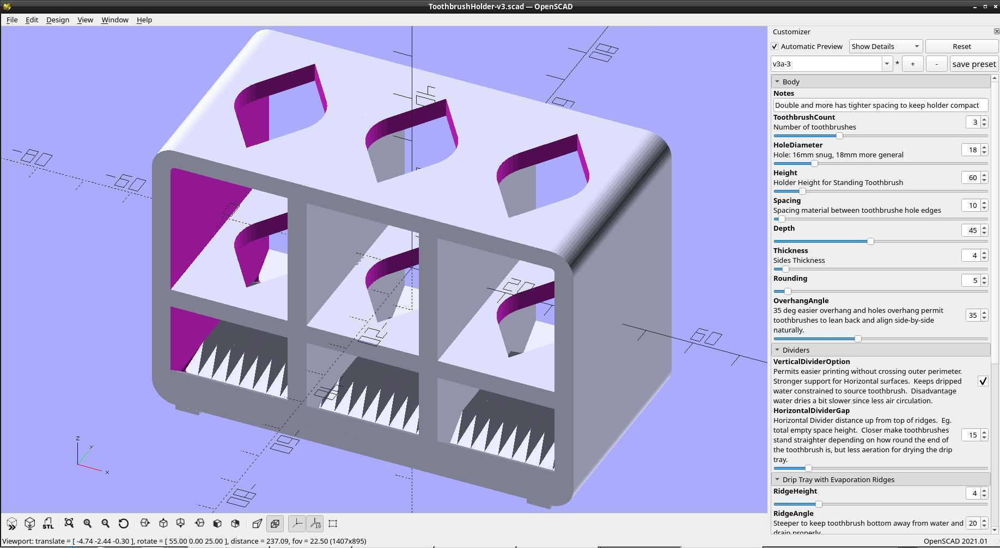

# Toothbrush Holder

## Design Features
- Easy to print laid down on back
- All overhangs configurable.  Easy to print 35 degree overhangs by default for all types of printers.
- Drip tray with offset and evaporation ridges.  The bottom tip of the toothbrush will never be sitting in stagnant water.
- Configurable number of toothbrushes
- Feet to offset base from surface to avoid water accumulation under by capillary action.

## Dependencies
Depends on the BOSL2 library, of which a cached local version is included.
https://github.com/BelfrySCAD/BOSL2

## Print Notes
- Print with back flat on print plate.
- Most print settings will work.  
- When the Vertical Divider option is active (default), the model is optimized for the "Avoid Crossing Perimeters" option which will give easier and cleaner prints on lower end printers.

## Images
### Double Toothbrush Holder Example
Standard 60mm height.

Side-by-side comparison of 80mm height with the standard 60mm height.

### OpenSCAD View

### Demo sizes 1 to 6

### PrusaSlicer Print Plate View
PrusaSlicer print plate view showing proper print orientation

### Thingiverse Link
https://www.thingiverse.com/thing:6573031

